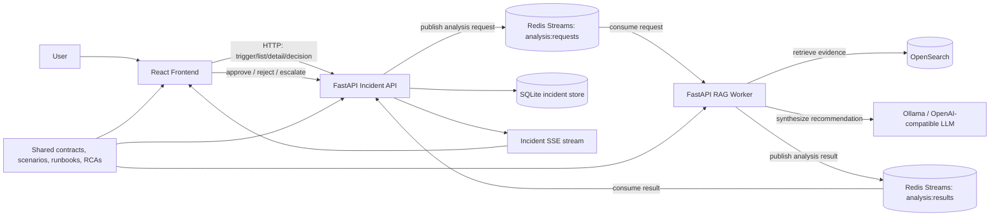

# SevLens V2 Architecture

This diagram captures the current V2 flow from incident trigger through async analysis and human decision.

## Notes

- The incident API is the system of record for incidents, events, decisions, and persisted recommendations.
- The RAG worker owns retrieval, evidence gathering, prompt assembly, and recommendation synthesis.
- Redis Streams is the async boundary between services.
- OpenSearch is the local log evidence backend for V2.
- SSE keeps the frontend synchronized with persisted incident updates.
